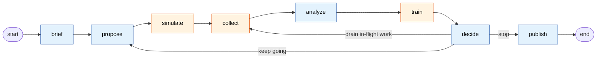
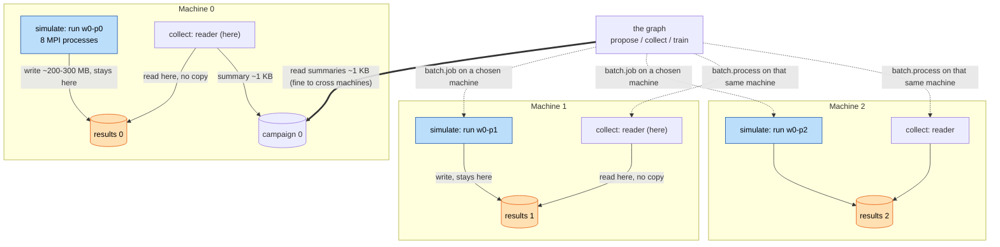

# Agentic AI for HPC science, inside the allocation: Dragon + LangGraph

You already write LangGraph agents. On HPC they run on the login node and reach
into the cluster through job scripts and the shared filesystem. **This demo runs
the same kind of graph *inside* the allocation** — the simulation, its data, the
model training, and the LLM all in one job — so the agent's decide-and-act loop
closes in memory instead of through files.

---

## 1. The pain, and why Dragon + LangGraph

An agent that steers HPC science has to do three things a chatbot never does:
launch real parallel jobs, get their large results back, and decide what to run
next from those results.

You can build this today, and people have. A common stack is an existing task
framework for the async job submission, an in-memory key-value or object store to
pass intermediate data instead of files, and a separate inference server for the
LLM. It works — AI-steered HPC campaigns have run at real scale on stacks like
this. The problem is not that closing the loop is impossible.

The cost is that you are assembling and operating several systems, and the seams
between them are yours to own. Where does the data store run, and who provisions
it? How is the task framework configured against the scheduler? Where does the
MPI job actually land — and does the data plane know to reduce a result on the
machine that produced it, or does it pull the result back to a coordinator first?
The steering logic is a small part; the rest is integration and operations, and
every seam is a place to version-match and a place to fail.

**Dragon collapses that stack into one runtime.** The MPI launch, the in-memory
store, the placement of work onto machines, and the LLM serving are the same
system — `Batch`, `DDict`, `Policy`, and in-allocation inference — running inside
your allocation. Data locality is a primitive rather than something you bolt on:
one line pins an MPI job to a machine, and the reduce is sent to that same
machine, so a result is used where it sits instead of shipped to a coordinator.
And the control flow stays the LangGraph graph you already write; Dragon runs it
across the allocation.

The table below is the concrete before/after for a team whose LangGraph agent
runs on the login node today. Even the improved login-node setup — files swapped
for a store, polling swapped for a task framework — is the left column assembled
by hand; the right column is one runtime.

| | LangGraph on the login node | LangGraph inside the allocation (this demo) |
|---|---|---|
| where a node runs | login node; compute reached via job scripts | any machine in the allocation, chosen from Python |
| how a node gets a result | write files or push to a store you run, then read back | reads it from an in-memory store that is part of the runtime |
| the large data | moved off the compute node to wherever the agent runs | stays on the machine that produced it |
| the LLM | a call to a server you stand up or an outside API | served on the allocation's own GPUs |
| what you operate | your graph, plus the task, data, and inference systems under it | your graph; Dragon is the one runtime under it |

**Why this, and not a stack you wire together yourself:**

- **One runtime, not several systems to operate.** No separate data store to
  provision and secure, no task backend to configure against the scheduler, no
  inference endpoint to stand up — and no version-matching or failure modes
  across the seams between them. That operational tax is the main thing you pay
  today, and it is what disappears.
- **Data locality is a built-in primitive, not glue.** One `Policy` line pins an
  MPI job to a machine and sends its reduce to that same machine, so a large
  result is used where it sits. Getting this out of a store-plus-task-framework
  stack takes real integration work.
- **Your LangGraph graph comes along unchanged.** The nodes and edges are the
  graph you already write; Dragon supplies the executor and the placement
  underneath. No rewrite into another framework's task model.

**Best fit:** a **data-heavy** loop that lives in **one allocation** and is
already written in **LangGraph** — that is where the three wins above compound.
If a workflow's outputs are already small, or it spans many separate jobs, the
data-locality edge shrinks and a simpler setup may be enough. This is a sharp
tool for the tight, data-heavy loop, not a universal replacement.

---

## 2. What this demo does, and how to run it

The workload is **active-learning surrogate training**. One run of a real MPI
simulation (miniAMR) takes minutes on many CPUs, and we want answers for
thousands of settings, which we cannot afford to run. So the agent decides which
settings are worth exploring and where to run them; Dragon's `Batch` launches
each one as a placed MPI job (`Policy` puts it on a chosen machine); and a small
stand-in model (a *surrogate*) is trained on the results. The interesting part is
the agent choosing which settings to run next from what it has learned — all
while the allocation is still open.

The control flow is an ordinary LangGraph `StateGraph`. Eight nodes; after
`decide` the loop goes round again, drains work still running, or finishes.



| node | what it does | LLM? |
|---|---|---|
| **brief** | Turn the request, written in English, into numbers: the range of settings, the run budget, the accuracy target. | yes |
| **propose** | Choose the next settings to run: score 400 candidates with the model ensemble, take the ones the members most disagree about. | no |
| **simulate** | Start one MPI simulation per chosen setting, each on one machine. Returns without waiting. | no |
| **collect** | Pick up finished runs; reduce each large result to one number on the machine that holds it. | no |
| **analyze** | Ask which part of the setting range to focus on next. Sees only the small summaries. | yes |
| **train** | Train a 3-model ensemble in parallel on every result so far. | no |
| **decide** | Judge whether the error has stopped improving, so the loop can stop early. | yes |
| **publish** | Save the surrogate, then answer 2000 settings from it in a fraction of a second. | yes |

After `decide`, one of three edges is taken:

- **keep going** (`decide -> propose`): the run budget is not used up yet, so start
  another wave of simulations.
- **stop** (`decide -> publish`): a stopping rule fired -- the model hit the
  accuracy target, the LLM called an early stop, or the budget ran out.
- **drain in-flight work** (`decide -> collect`): the budget is used up, so there
  is nothing new to launch, but simulations, reductions, or model fits started in
  earlier waves are still running. Because waves overlap, a run launched a few
  waves back may only finish now. Rather than throw that away, the loop goes back
  to `collect` to pick up those late results and train on them one more time.
  This repeats (a short sleep between checks) until everything drains or a cap
  (`DRAIN_WAVES`) is hit, then it publishes. Anything that never drained in time
  shows up as the `still going: N not finished when we stopped` summary line.

### Build miniAMR with the DDict hook

The demo needs miniAMR to write its result into the shared store instead of to
files. That takes a small patch to miniAMR's own source. We do **not** ship a
patched miniAMR in this repo — miniAMR is LGPL, and we would rather not
redistribute a modified copy — so you apply the patch to your own clone. Only two
new files come from us, and they are here in `miniamr/`.

1. **Clone miniAMR** and copy our two files into its reference source:

   ```bash
   cp miniamr/miniamr_ddict.c miniamr/miniamr_ddict.h  /path/to/miniAMR/ref/
   ```

2. **Add three lines to `miniAMR/ref/main.c`.** Near the other includes:

   ```c
   #include "miniamr_ddict.h"
   ```

   Then, after the `profile();` call and before `deallocate();`, add the block
   that writes each active block's field into the store on its own node:

   ```c
   /* Write each active block's field into the Dragon DDict, node-local.
    * Layout [num_vars][x+2][y+2][z+2] in C order must match physics.MESH_DIMS.
    * Keys: blocks under mesh/<run>/r<pe>/b<i> (contiguous i) plus a per-rank
    * count mesh/<run>/r<pe>/n, so the reader fetches blocks by exact key. */
   {
      const char *serial = getenv("MINIAMR_DDICT");
      const char *run    = getenv("MINIAMR_RUN");
      if (serial && run && miniamr_ddict_open(serial) == 0) {
         int xs = x_block_size + 2, ys = y_block_size + 2, zs = z_block_size + 2;
         size_t ncell = (size_t) num_vars * xs * ys * zs;
         double *packed = (double *) malloc(ncell * sizeof(double));
         char key[64];
         int nb = 0;
         for (int n = 0; n < max_active_block; n++) {
            if (blocks[n].number < 0)
               continue;
            size_t p = 0;
            for (int v = 0; v < num_vars; v++)
               for (int ii = 0; ii < xs; ii++)
                  for (int jj = 0; jj < ys; jj++)
                     for (int kk = 0; kk < zs; kk++)
                        packed[p++] = blocks[n].array[v][ii][jj][kk];
            /* Contiguous index so the reader addresses blocks by exact key. */
            snprintf(key, sizeof(key), "mesh/%s/r%d/b%d", run, my_pe, nb);
            miniamr_ddict_put(key, (uint8_t *) packed, ncell * sizeof(double));
            nb++;
         }
         /* Manifest: block count for this rank, as int32. */
         {
            int32_t nb32 = (int32_t) nb;
            snprintf(key, sizeof(key), "mesh/%s/r%d/n", run, my_pe);
            miniamr_ddict_put(key, (uint8_t *) &nb32, sizeof(nb32));
         }
         free(packed);
         miniamr_ddict_close();
      }
   }
   ```

3. **Add four lines to `miniAMR/ref/Makefile`** so it compiles the new file and
   links Dragon:

   ```make
   CPPFLAGS = -I. -I$(DRAGON_BASE_DIR)/include     # add the Dragon include dir
   LDFLAGS  = -L$(DRAGON_BASE_DIR)/lib             # add the Dragon lib dir
   LDLIBS   = -lm -ldragon                         # link libdragon
   OBJS    += miniamr_ddict.o                      # compile our file into the build
   ```

4. **Build** (`make` in `miniAMR/ref`) with `DRAGON_BASE_DIR` set, and pass the
   resulting `miniAMR.x` to `--bin` below.

The write hook is the only change to miniAMR. Everything else — placement,
reading the result in place, training, the LLM — is on our side and needs no
solver changes.

### Run it

This demo is tuned for a **4-node allocation**. To use `--llm`, **at least one of
those nodes must have a GPU**, because the LLM is served in-allocation by Dragon's
inference service (one GPU is enough — `--gpus 1`). Without `--llm` no GPU is
needed and the LLM nodes are skipped.

Inside the allocation (do not pass `-s`, which forces everything onto one
machine):

```bash
dragon campaign.py --bin /path/to/miniAMR.x                 # no GPU; the LLM nodes are skipped
dragon campaign.py --llm <model-path> --gpus 1 --bin /path/to/miniAMR.x
```

Without `--llm` the campaign still runs, steering on model disagreement alone —
so you can run it both ways and see what the LLM adds.

---

## 3. How the demo delivers each claim, and where to see it

Section 1 made the promises. Here is where each one lives in the eight-node loop
from Section 2, the Dragon API that delivers it, and the line of output that lets
you check it when you run it.

| §1 claim | node(s) that do it | Dragon mechanism | see it in the run |
|---|---|---|---|
| your LangGraph graph runs unchanged | every node | `DragonExecutor` wraps each graph node so Dragon runs it as a process placed on a machine, instead of a callable on the login node | the graph in `campaign.py` is a plain `StateGraph` |
| the large data stays where it is produced | `simulate` writes, `collect` reduces | **data locality**: a `DDict` keeps each result in memory on the machine that made it, and a `Policy` pins both the run and the reader to that same machine so the result is used in place | `result data read`, `read locally` |
| simulation and training overlap | `simulate` / `collect` / `train` | `Batch` starts simulations and training jobs without waiting for them, so the graph keeps moving and the work runs at the same time | `simulations … across N round(s)` vs `total time`; each fit prints its machine |
| the LLM makes the judgment calls | `brief`, `analyze`, `decide`, `publish` | the **Dragon inference service** serves the LLM on the allocation's own GPUs, so a node can call it without leaving the machine | the `LLM` line |
| an agent keeps heavy state resident | `propose` | a Dragon node process stays alive between rounds, so it holds the trained model in memory and only checks a small version key in the `DDict` each round | `model in memory: copied N, reused M` |

The rest of this section is the three parts of that table worth a closer look:
the one change to your graph, what the **worker** nodes (orange in Section 2) do
with the data, and what the **thinker** nodes (blue) do with the LLM.

### The one change to your graph: the executor

The nodes and edges are the graph you would write anyway. Two Dragon lines wrap
each node as a placed process and launch the node groups onto machines — that is
the whole integration:

```python
with DragonExecutor() as executor:
    for name in ("brief", "propose", "simulate", "collect",
                 "analyze", "train", "decide", "publish"):
        g.add_node(name, executor.node(name))       # your node, run on the allocation
    g.add_conditional_edges("decide", next_step,     # the steering policy, still a graph
                            {"refine": "propose", "wait": "collect",
                             "publish": "publish"})
    executor.launch_hosts([thinkers, workers])       # place the nodes on machines
```

`executor.node(name)` makes a node run as a Dragon process on a chosen machine
instead of a callable on the login node. Nothing about your graph's logic changes.

### The worker nodes: bring the compute to the data

`simulate`, `collect`, and `train` are where the heavy work and the large data
live. Two things happen here, both from plain Python.

**The result never leaves the machine that made it — this is data locality.**
`simulate` starts each run as a placed `batch.job` — a `Policy(HOST_NAME)` pins it
to one machine — and miniAMR writes its 200-300 MB result into the piece of the
mesh `DDict` on that same machine. `collect` then starts the reducing step there
too, as a placed `batch.process`, so it reads the result in place and sends back
only the ~1 KB summary. Sending the code to the data, instead of the data to the
code, is what `DDict` node-local storage plus `Policy` placement buy you — no
result ever crosses the network:



**Work overlaps instead of queueing.** `batch.job` and `batch.function` both
return immediately; the graph polls them with `task.get(block=False)`. So
`simulate` opens a wave without waiting, `collect` starts the next wave as soon as
enough results are in, and `train` fits the three ensemble members at the same
time on whatever machines are free. The same `Policy` + `ProcessTemplate` that
pins a simulation also pins training, so a heavy one-per-GPU ensemble is a couple
of lines away, with weights returned through the store, not the filesystem.

### The thinker nodes: judgment in the allocation

`brief`, `analyze`, `decide`, and `publish` call the LLM; `propose` reasons over
the trained models. These nodes are light and never touch the large data.

The LLM handles four fuzzy calls — everything numeric stays ordinary code:

| node | given | returns |
|---|---|---|
| **brief** | the English request, and the legal range of settings | budget, accuracy target, range to explore |
| **analyze** | the last few runs' settings, results, and failures | a smaller range to focus the next runs on |
| **decide** | the error after each retraining, and runs left | keep going, or stop early |
| **publish** | the final counts | one sentence on when not to trust the model |

`decide` is the one that earns its keep: **has the error stopped improving, or is
it just noisy?** A threshold gets that wrong both ways — it quits on a lucky dip
or burns the budget on a model that plateaued twenty runs ago. Judging the shape
of a short, noisy sequence is a good use of a model and a bad use of an `if`.

Two guarantees make an LLM safe in the loop: it only ever sees the reduced
numbers, never the 200-300 MB result; and every reply is checked against a JSON
schema and clamped to legal values, so `decide` can stop the loop sooner but
never spend past the budget. Which settings to run next is not even the LLM's
call — that is the three models' disagreement, a numeric question. The model is
served by the **Dragon inference service** on the allocation's own GPUs, called
from a node with `get_llm(inference_queue).chat()`, so nothing leaves the machine
and there is no API key or endpoint anywhere in the demo.

`propose` shows the other half of "thinker": because its Dragon process is
long-lived, it keeps the trained surrogate resident (`active_surrogate`) and reads
only a one-line version string from the `DDict` each round, re-fetching weights
only when `train` makes a new model. The surrogate here is small, so the saving is
modest — but the same pattern is what lets a node hold an expensive resident
model, a warm GPU cache, or an open connection across the whole loop, which a
fresh-process-per-step login-node agent cannot.

---

## 4. Status and roadmap

**This is a first proof of concept.** It runs end to end and every claim above is
something you can watch happen, but it is deliberately small. It already does
**AI-steered active learning**: the LLM and the model ensemble choose what to
simulate next and when to stop, between runs, while the allocation is open. What
follows is the planned work to take it from a POC to something you would run on a
real campaign.

**1. Crash recovery, so a long campaign survives a lost process.**
The loop runs in one process. If it dies mid-campaign — a node failure, a walltime
cut — the run restarts from round zero and every finished simulation is wasted.
Plan:
- Write the LangGraph state (round, budget spent, which runs are still out) into
  the campaign DDict at the end of each node, under a known key.
- Persist the DDict itself with its checkpoint support (`PosixCheckpointPersister`),
  so the store survives the process, not just a restart of the loop.
- On startup, if a saved state key exists, rebuild the campaign from it and
  re-enter the graph at the saved node instead of `brief`. Re-collect
  already-finished simulations by run id rather than launching them again.

**2. Scale past a handful of machines, with the data-plane win measured.**
Runs today on a few machines. Plan:
- Raise the machine count and the per-run result size (`--field 512` and up), so
  the amount of data kept off the network is large enough to state as a number.
- Report bytes-reduced-in-place against bytes-that-would-have-crossed, and
  same-machine vs cross-machine read counts, at each scale.
- Add refill scheduling so freed machines pick up the next simulation
  immediately, keeping utilization high as the machine count grows.

**3. Steering *inside* a running simulation, not just between runs.**
Today the agent steers the campaign between runs. The larger goal is to reach
into a simulation while it is still going and adjust it from a live, reduced
signal — for example, tell miniAMR to refine differently, or stop a run that is
diverging, without waiting for it to finish. Plan:
- Add a control hook to miniAMR's timestep loop that reads a flag
  (continue / refine / stop) from the DDict each check — the counterpart to the
  result-writing hook it already has.
- Place a small in-loop reader on the run's own machine that watches the live
  field and writes that flag; keep the LLM in the slow outer loop, reasoning over
  summaries across runs, not in the per-timestep path.
This one needs a solver built to take direction mid-flight, which miniAMR is not
yet — it is the biggest of the three and the clearest proof of the tight-loop
advantage.

Expect this demo to grow along those three lines, in that order.
